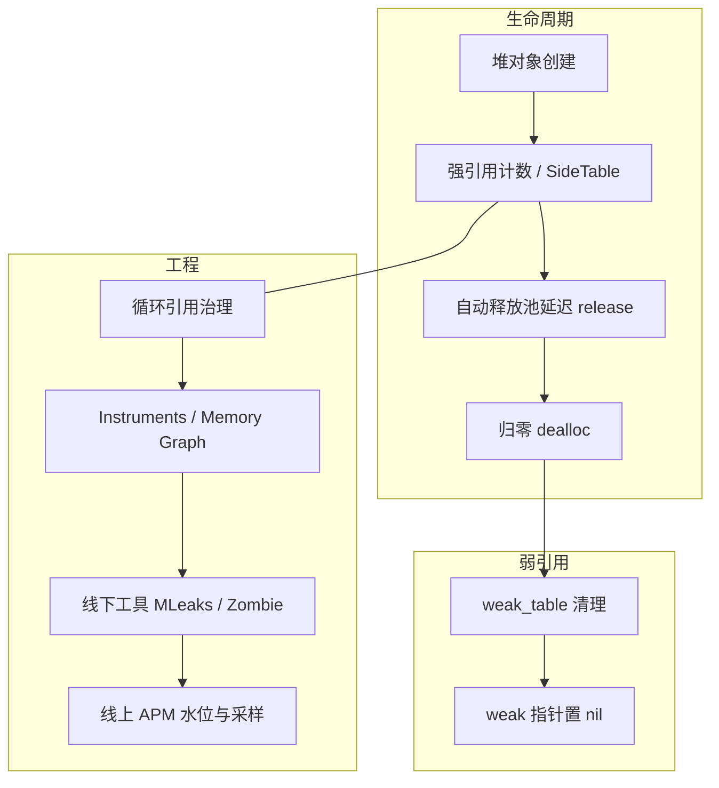

# iOS 内存管理完全指南

> **适用**：系统复习与面试冲刺  
> **最后更新**：2026-04-07  
> **说明**：下文关于 `isa` 位域、`extra_rc`、SideTable 等是对 **Apple objc4 源码** 的教学抽象；具体位宽与策略可能随系统演进，请以当前版本源码为准。Swift 侧语言层细节可对照 [Swift-内存管理与ARC.md](../01-语言基础/Swift-内存管理与ARC.md)。

---

## 目录

1. [内存管理概述](#1-内存管理概述)
2. [引用计数原理](#2-引用计数原理)
3. [Tagged Pointer 与引用计数存储策略](#3-tagged-pointer-与引用计数存储策略)
4. [ARC 与 MRC](#4-arc-与-mrc)
5. [weak 实现原理](#5-weak-实现原理)
6. [AutoreleasePool 原理与 RunLoop](#6-autoreleasepool-原理与-runloop)
7. [循环引用与解决方案](#7-循环引用与解决方案)
8. [内存泄漏检测（线下）](#8-内存泄漏检测线下)
9. [内存优化实战](#9-内存优化实战)
10. [面试高频题与速记](#10-面试高频题与速记)
11. [附录：MLeaksFinder、Zombie 与线上监控](#appendix-leak-tools)

---

## 1. 内存管理概述

### 什么是内存管理？

内存管理就是管理对象的生命周期：**创建、使用、销毁**。

### 费曼类比：图书馆借书

```
图书馆的书 = 内存中的对象
借书卡 = 引用计数

┌─────────────────────────────────────────────────────────────┐
│ 你借了一本书（alloc）→ 引用计数 = 1                          │
│ 朋友也想看，你帮他借（retain）→ 引用计数 = 2                  │
│ 你还了书（release）→ 引用计数 = 1                            │
│ 朋友还了书（release）→ 引用计数 = 0 → 书被放回书架（dealloc） │
└─────────────────────────────────────────────────────────────┘
```

### iOS 内存布局

```
高地址
┌─────────────────┐
│    内核 space   │ ← 操作系统内核
├─────────────────┤
│     栈区        │ ← 函数调用、局部变量（向低地址生长）
│                 │   自动分配/释放，速度快
├─────────────────┤
│     堆区        │ ← 动态分配（向高地址生长）
│                 │   OC 对象等，ARC/MRC 管理
├─────────────────┤
│  未初始化数据   │ ← BSS 段
├─────────────────┤
│  已初始化数据   │ ← Data 段
├─────────────────┤
│    代码区       │ ← Text 段（只读）
└─────────────────┘
低地址
```

---

## 2. 引用计数原理

### nonpointer isa 中的引用计数（示意）

教学用简化（真实布局见 objc4 `isa.h`）：

```c
union isa_t {
    struct {
        uintptr_t nonpointer        : 1;
        uintptr_t has_assoc         : 1;
        uintptr_t has_cxx_dtor      : 1;
        uintptr_t shiftcls          : 33;
        uintptr_t magic             : 6;
        uintptr_t weakly_referenced : 1;
        uintptr_t deallocating      : 1;
        uintptr_t has_sidetable_rc  : 1;  // 溢出后使用 SideTable
        uintptr_t extra_rc          : 19; // 位数随架构而定，非固定 8 位
    };
};
```

### 引用计数存储规则（概念）

```
┌─────────────────────────────────────────────────────────────┐
│ 引用计数存储策略（概念）                                      │
├─────────────────────────────────────────────────────────────┤
│ Tagged Pointer：不计入常规引用计数（无独立堆对象）             │
│ isa.extra_rc：小额增量存在（快路径）                           │
│ has_sidetable_rc：溢出 → 在 SideTable 中继续维护（慢路径）     │
└─────────────────────────────────────────────────────────────┘
```

### SideTables 结构（概念）

```c
struct SideTable {
    spinlock_t slock;                 // 自旋锁
    RefcountMap refcnts;              // 引用计数
    weak_table_t weak_table;          // 弱引用表
};

// 全局多张 SideTable（StripedMap），按对象地址分散，减少锁竞争
```

### retain / release（伪代码流程）

```c
// 教学用伪代码，非逐行等价源码
id objc_object::rootRetain() {
    if (isTaggedPointer()) return (id)this;
    if (可在 isa 中增加 extra_rc) {
        extra_rc++;
        return (id)this;
    }
    将计数转移到 SideTable 或在 SideTable 上递增;
    return (id)this;
}

id objc_object::rootRelease() {
    if (isTaggedPointer()) return (id)this;
    if (isa 中 extra_rc 可递减) {
        extra_rc--;
        return nil; // 仍存活
    }
    走 SideTable / 慢路径，计数归零则 dealloc;
    return nil;
}
```

### retainCount 的常见误区

- **不要依赖 `retainCount` 做逻辑判断**；调试价值有限。
- 教学上常说「alloc 之后为 1」：对外表现为持有关系成立即可；底层在 isa/SideTable 中的编码方式与「直接等于 1」不必强行数值对齐。

---

## 3. Tagged Pointer 与引用计数存储策略

### Tagged Pointer 是什么？

小对象（如部分 `NSNumber`、短 `NSString` 等）可将数据编码在指针中，**无需单独堆分配**，也走不常规堆对象的引用计数路径。

### 识别与效果（示例）

```objective-c
NSNumber *num1 = @10;
NSNumber *num2 = @0x10000000000; // 可能超出 Tagged 范围（与平台/实现有关）

NSLog(@"num1: %@", [num1 class]);
NSLog(@"num2: %@", [num2 class]);
```

**效果**：省内存、少一次堆访问、避免额外原子/表操作。

### 三种路径小结

| 路径 | 说明 |
|------|------|
| Tagged Pointer | 指针即数据，无常规堆对象 |
| isa.extra_rc | 快路径增量 |
| SideTable | 溢出、弱引用表、复杂状态 |

---

## 4. ARC 与 MRC

### MRC（手动引用计数）

```objective-c
Person *person = [[Person alloc] init];
[person retain];
[person release];
[person release]; // 归零 → dealloc

- (void)setName:(NSString *)name {
    if (_name != name) {
        [_name release];
        _name = [name retain];
    }
}
```

### ARC（自动引用计数）

编译器在合适位置插入 `retain` / `release` / `autorelease`，开发者写「所有权语义」。

```objective-c
@property (nonatomic, strong) NSString *name;

// setter 语义等价于：新值 retain、旧值 release（顺序由编译器保证正确）
```

### 所有权修饰符

| 修饰符 | 作用 | 与 MRC 类比 |
|--------|------|-------------|
| `__strong` | 强引用（默认） | `retain` |
| `__weak` | 弱引用，释放后置 nil | 类似 `assign` + 自动清零 |
| `__unsafe_unretained` | 不 retain，不置 nil | `assign`（易悬空） |
| `__autoreleasing` | 传给 `autoreleasing` 入参等 | `autorelease` |

---

## 5. weak 实现原理

### 核心数据结构（示意）

```c
struct weak_table_t {
    weak_entry_t *weak_entries;
    size_t num_entries;
    uintptr_t mask;
    uintptr_t max_hash_displacement;
};

struct weak_entry_t {
    DisguisedPtr<objc_object> referent; // 被引用对象
    // referrers：登记各个 weak 变量地址的数组（实现上有内联/溢出等优化）
};
```

### weak 注册（流程）

```
objc_initWeak(location, newObj)
  → storeWeak
  → 定位 SideTable / weak_table
  → weak_entry_for_referent / insert
  → append_referrer（把 &weakVar 登记进去）
```

### 释放时置 nil（流程）

```
dealloc 路径中 → clearDeallocating
  → weak_clear_no_lock(weak_table, referent)
  → 找到 entry，遍历 referrers，将 *location = nil
  → 移除 entry 等清理
```

### weak / assign / unsafe_unretained

| 特性 | weak | assign / unsafe_unretained |
|------|------|----------------------------|
| 引用计数 | 不增加 | 不增加 |
| 对象释放后 | 置 nil | 可能野指针 |
| 性能 | 需维护表 | 更轻 |

### 费曼类比：房屋登记

```
房屋 = 对象
登记表 = weak_entry
名册 = referrers

弱引用 = 去登记处登记「我关心这套房」
拆迁（dealloc）= 按登记表通知所有人「房没了」（指针变 nil）
```

---

## 6. AutoreleasePool 原理与 RunLoop

### AutoreleasePoolPage（概念）

- 每页约 **4096 字节**量级，**双向链表**串起多页。
- `push` 写入 **哨兵（POOL_BOUNDARY）**；`pop` 到哨兵之间逐个 `release`（或走等价逻辑）。
- **线程私池**：与 `pthread` 关联，主线程池由 RunLoop 节奏驱动。

### 主线程与 RunLoop（要点）

```
RunLoop 一次迭代中常见节奏：
- Entry：可能 push
- BeforeWaiting：pop 旧池并建立新池（清理临时 autorelease 对象）
- Exit：再 pop
```

**子线程**：无 RunLoop 时若产生 autorelease 对象，需自管 `@autoreleasepool`（例如 GCD `dispatch_async` 长时间任务）。

### 实战：循环内降峰值

```objective-c
for (int i = 0; i < 100000; i++) {
    @autoreleasepool {
        NSString *str = [NSString stringWithFormat:@"%d", i];
        (void)str;
    }
}
```

---

## 7. 循环引用与解决方案

### delegate

```objective-c
// ❌ strong 持有 delegate 易成环视结构而定
// ✅ 常见：property 用 weak
@property (nonatomic, weak) id<MyDelegate> delegate;
```

### Block

```objective-c
// ❌ self → block → self
__weak typeof(self) weakSelf = self;
self.block = ^{
    __strong typeof(weakSelf) strongSelf = weakSelf;
    if (strongSelf) {
        [strongSelf doSomething];
    }
};
```

### NSTimer

```objective-c
// ❌ Timer 强引用 target 常见成环：RunLoop → Timer → self

// ✅ 中间弱代理（NSProxy）
@interface TimerProxy : NSProxy
@property (nonatomic, weak) id target;
@end

// ✅ iOS 10+ Block API + weakSelf
__weak typeof(self) weakSelf = self;
self.timer = [NSTimer scheduledTimerWithTimeInterval:1.0 repeats:YES block:^(NSTimer *t) {
    [weakSelf timerFired];
}];
```

### 互相持有

一端 `strong`、另一端 `weak`，或引入第三方_holder 打破环。

### NSNotification（面试常见表述）

- **iOS 9+** 对 `addObserver:selector:name:object:`：`NotificationCenter` 对 **observer 不再强引用**（但仍建议成对 `removeObserver`，避免重复注册、逻辑混乱）。
- 使用 **block 式** `addObserverForName:… usingBlock:` 时须保存返回值并在适当时机 `removeObserver:`（该路径仍需手动移除）。

### 静态图检测：FBRetainCycleDetector

```objective-c
FBRetainCycleDetector *detector = [FBRetainCycleDetector new];
[detector addCandidate:self];
NSSet *cycles = [detector findRetainCycles];
```

---

## 8. 内存泄漏检测（线下）

### Instruments

- **Leaks**：泄漏追踪
- **Allocations**：分配热点、匿名 VM
- **Zombies**：访问已释放对象（调试专用，勿用于线上）

### Xcode Memory Graph

运行 → Debug Memory Graph → 查看强引用链与异常增长对象。

### Analyze

`⌘⇧B` 静态分析，补捉常见错误。

### dealloc 日志（开发期）

```objective-c
- (void)dealloc {
    NSLog(@"✅ %@ released", NSStringFromClass([self class]));
}
```

---

## 9. 内存优化实战

### 图片：降采样 / ImageIO

- 避免无谓解码全尺寸位图；列表场景优先 **下采样 + 合适缓存**。
- `CGImageSourceCreateThumbnailAtIndex` 等可在不完全展开大图的情况下取缩略图。

### NSCache

用 **总 cost / countLimit** 约束内存；内存压力大时可被系统清理（比自建 `NSDictionary` 更适合图片缓存）。

### 峰值控制

- 分页、流式处理，避免一次性 `loadAll`。
- 大批量临时对象包在 `@autoreleasepool` 中。

### Checklist（节选）

- 大图降采样；`NSCache` 做缓存
- `delegate` / 出口用 `weak`；Block 用 weak-strong dance
- `NSTimer`：`invalidate` + 打破环；优先 block API + `weakSelf`
- `didReceiveMemoryWarning` / 场景退出时清缓存
- 定期 Instruments / Memory Graph

---

## 10. 面试高频题与速记

### 简表

| 问题 | 要点 |
|------|------|
| strong / weak？ | strong 持有多久活多久；weak 不增计数，释放后置 nil |
| weak 原理？ | weak_table 登记变量地址；`dealloc` 时遍历置 nil |
| autoreleasepool？ | 页链表 + 哨兵；push/pop；RunLoop 驱动主线程池 |
| 常见循环引用？ | delegate、block、timer、双强引用 |
| ARC 仍泄漏？ | 循环引用、CF 对象、malloc、底层 C 资源未释放 |
| Tagged Pointer？ | 小对象指针内编码，无常规堆对象路径 |
| Swift 补充？ | `weak` vs `unowned`、值类型 COW → 见 Swift 专文 |

### 口诀

```
引用计数：alloc 持有 / retain 加 / release 减 / 归零 dealloc
weak：全局弱表，释放清 entry，指针全变 nil
autoreleasepool：链表分页，边界标记，pop 批量释放
循环引用：delegate weak，block weakSelf，timer 断环
优化：大图降采样，NSCache，警告清缓存
```

---

## 附录：MLeaksFinder、Zombie 与线上监控

<a id="appendix-leak-tools"></a>

### A. MLeaksFinder（思路 · 适合开发期）

**核心**：在「**认为该释放**」的时机（如 VC dismiss/pop 后），`__weak` 引用目标，延迟数秒仍存活 → 怀疑泄漏。

**流程概要**：

1. Swizzle VC / Nav 相关路径，找「应释放点」
2. `dispatch_after` + `weak` 检查是否仍存在
3. DEBUG 弹窗 / 断言（**不适合线上直接照搬**）

**为何延迟**：避开仍在 autoreleasepool、转场动画未完成等短生命周期假象（具体秒数为工程经验值）。

**局限**：白名单（全局单例等）；误判与漏判可能；依赖 UI 栈假设。

### B. Xcode Zombie（调试）

- 对象 `dealloc` 后不立即归还为「可复用裸内存」，而是将 **isa 指到 Zombie 类**（概念；实现细节因版本而异），再次发消息时 **打印原类名 + 选择子** 并终止。
- **副作用**：内存占用飙升，仅调试。

### C. 线下方案为何难照搬线上

| 工具 | 线下 | 线上风险 |
|------|------|----------|
| MLeaksFinder | 断言 / 弹窗 / Hook | 崩溃、性能、隐私 |
| Zombie | 不真正释放 | 内存暴涨 |
| Instruments | 人工 | 无法随包分发 |

### D. 线上可参考思路（与 APM）

- **内存水位**：`task_info` 等周期采样，异常曲线上报
- **页面级弱引用迟检**：去断言、采样率、后台队列，合并同类型告警
- **OOM / 异常退出**：下次启动归因（仅能近似）
- **Retain cycle 图遍历**：重，适合离线或极低采样

第三方 APM（Firebase、Sentry、国内套件等）选型按合规与成本评估。

### E. 对比速记

```
MLeaksFinder：weak + 延迟，开发利器，别直接上生产
Zombie：isa 换僵尸类，抓 use-after-free，调试专用
线上：采样 + 上报 + 水位，放弃「必现级」精度换稳定
```

---

## 知识图谱（总览）



---

## 参考资料

### 文章与话题

- [YTMemoryLeakDetector iOS内存泄漏检测工具类](https://segmentfault.com/a/1190000012121342)
- [自动检测VC内存泄漏](https://www.jianshu.com/p/870318df8b47)
- [深入探索iOS内存优化](https://juejin.cn/post/6864492188404088846)
- [Mastering Swift's Memory Management: ARC, Weak, Unowned](https://medium.com/@commitstudiogs/mastering-swifts-memory-management-arc-weak-unowned-and-strong-references-74f40f069994)

### 开源

- [FBRetainCycleDetector](https://github.com/facebook/FBRetainCycleDetector)
- [MLeaksFinder](https://github.com/Tencent/MLeaksFinder)
- Apple **objc4** 源码（引用计数 / weak / autoreleasepool）

---

## 与目录内其它文档的关系

| 文档 | 关系 |
|------|------|
| 本文 | **主线**：OC 堆内存、RC、weak、pool、泄漏与优化总览 |
| [iOS多线程完全指南](./iOS多线程完全指南.md) | 并发；子线程与 autoreleasepool；libdispatch |
| [锁的分类与性能对比](./锁的分类与性能对比.md) | 与内存无直接耦合，同属本章 |

**最后更新**：2026-04-07  
**状态**：✅ 主线成文（原 ARC/AutoreleasePool、Weak、循环引用与检测 三专题已并入本文）
