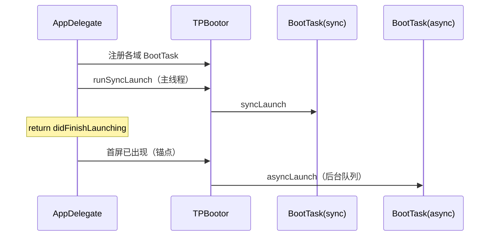

# 面试模拟 05：启动优化

> 对应整理题：**「怎么做启动优化？」「启动任务多怎么管理？」**  
> **阅读顺序（面试向）**：① 文首 **STAR**（以 **Gravity** 事实串完整故事）→ ② **速答卡片** → ③ **延伸学习与底层原理**（追问时展开）→ ④ **附录 Q&A** → ⑤ **补篇**（现行框架短板 + DAG/优先级演进，答「还能怎么优化」）。  
> 可与 [面试模拟-01-语音房大型重构](./面试模拟-01-语音房大型重构.md) 中「全链路 / 首屏」叙事互相引用。

---

## STAR 作答：「怎么做启动优化？启动任务多怎么管理？」（Gravity，可脱敏）

**STAR 只讲 Gravity 里实际怎么做的**；dyld、缺页、`+load` 细节、完整工具表及 **BootTask 架构** 见 **「延伸学习与底层原理」**，附录供追问速查。

### S｜Situation（情境）

随着 **Gravity** 业务越来越大、依赖越来越多，**用户和 QA 都反馈 App 启动很慢**。我们自己拿机子反复测，**平均冷启动大概要 3 秒左右**，和 **内部对标的体验线（约 1.1 秒）** 相差甚远——数字来源可以是竞品手测、第三方体验报告或公司红线，面试前准备一句即可。前期为了追迭代，启动流程堆得比较 **简单、粗放**，现在必须 **升级**：做一套 **可量化、可控制** 的启动优化框架，别再加一个需求就把启动打回去。  
拆下去根因还是那些：**SDK 和同步初始化越堆越多**（`didFinishLaunching` 过重），**语音房** 相关的 **RTC、特效** 也有过 **不该在冷启就拉起** 的情况。

### T｜Task（任务）

我们的目标，是把 **冷启动压到 2 秒以内**（口径与埋点一致，例如点击 → 首屏可交互）。大方向就两块：**Pre-main** 阶段 **控制增量**（新 SDK、动态库、`+load` / initializer 等）；**post-main** 阶段 **拆优先级、定好时序**，别让 `didFinishLaunching` 再堆成一锅粥。具体落地（BootTask、准入、Order File、语音房边界等）放在 **Action** 里展开。

### A｜Action（行动）

**（1）度量与基线**  
在 Gravity 先统一「看什么数」：开发期 **`DYLD_PRINT_STATISTICS`**、**Instruments → System Trace**（重点跟 **Page Fault**）；业务侧 **`didFinish` → 首屏可交互** 自定义埋点，报表用 **P90/P95**，并在 **低端机** 上多轮冷启对齐体验；必要时用 **LinkMap** 看段大小、定位大模块。（**工具清单、为何看 P90 见延伸学习「测量」**。）

**（2）Pre-main 与 SDK 增量控制**  
Gravity 大仓第三方多，和架构一起落 **SDK 准入**：新库必须 **显式 start**，提交 **Pre-main / +load / dylib** 影响说明，非核心能力 **首屏后异步**；存量侧 **能迁走的 +load 迁走**、**合并内部 Pod**、轻量依赖尽量 **静态化**。数据到位后上 **Order File**：用启动模板采 **main → 首屏** 热路径符号，配置 **`-order_file`**，用 **Page Fault** 做前后对比。（**Order File 原理、+load/C++ 全局构造等见延伸学习「核心优化手段」**。）

**（3）BootTask / TPBootor：解决「任务多」**  
不再往 `didFinishLaunching` 无限堆逻辑：各域（**日志、网络监控、广告、业务配置、启动接口** 等）各自实现 **BootTask**，向 **TPBootor** 一类分发器 **注册**。**syncLaunch** 只保留 **IM、推送、崩溃监控（若规范要求极早）、首屏强依赖配置** 等——**能少则少**，且 **每条任务有 owner + 耗时预算**。**asyncLaunch** 承接 **用户中心、敏感词、设备上报、非首屏 SDK** 等，挂在 **首屏 `viewDidAppear` 或短延迟**，避免和主线程布局抢时间。**BootTask 先把责任边界和可维护性搞定，性能靠严格执行分级 + 监控超标就回滚或再拆。**（分发器职责、时序图、可演进点见 **延伸学习 · 三 · §3**。）

**（4）首屏、Tab 与语音房边界**  
路由尽快定 **Window / RootVC、登录或 Tab**；**Tab 子页懒加载**，避免所有 Tab 在启动时一次性 **`loadView`**。**语音房不是冷启必经路径**：**RTC、特效** 等 **进房链路按需初始化**，**不** 放进 syncLaunch；与 [面试模拟-01](./面试模拟-01-语音房大型重构.md) 一致——**启动管全局与首屏，房间管进房后**。

**（5）防回归与规范**  
新增 BootTask **默认走 async**，要进 sync 须评审；CI 或脚本盯 **+load、动态库数量** 趋势；持续看 **启动 P90**（有条件再跟 **Page Fault**）。团队内沉淀 **checklist** 与 SDK 标准（细则见 **附录 Q1**）。

**（6）面试收口一句（Gravity）**  
「Pre-main 靠 **SDK 准入 + Order File** 控增量；Main 后靠 **BootTask + sync/async** 稳住首屏和语音房入口，**重模块进房或首屏后再起**，用 **P90 启动监控** 防回归。」

### R｜Result（结果）

- **体验与指标**：**同一口径下**，从 S 里 **约 3 秒级** 拉到 **Task 定的 2 秒以内**（填 **P90/P95：__ → __ 秒** 与埋点对齐）；若仍保留 **约 1.1 秒** 的外部/内部标杆，可写是否继续逼近；**首屏可交互** 前置；Order File 与库治理前后可在实验包对比 **Page Fault**。  
- **工程收益**：`didFinishLaunching` **结构清晰**；各域 **BootTask** **可审计、可追责**；Pre-main **增量被准入卡住**，避免「加一个 SDK 拖死启动」。  
- **质量兜底**：**crash 率与全量回归** 验证；**不采用** dyld 改写等高风险手段。  

**下划线处填真实 before/after**；若面试官问「行业一般多少」，可答：**定义不一致时没有统一标准，我们更看自家分位是否持续下降、是否守住门禁**。话术模板见 **延伸学习「高频面试问题应答模板」**。

---

## 零、面试速答卡片（30 秒版）

**完整叙事以文首 STAR（Gravity）为准**；下表便于进场前 30 秒过一遍。

| 问题 | 一句话 |
|------|--------|
| 冷启分几段？ | **Pre-main**（dyld、+load、静态构造）+ **Main 后**（didFinish → 首屏可交互）。 |
| Main 任务多？ | **分级 + 延后**：P0 同步，P2/P3 首屏后或子线程；用 **BootTask + TPBootor** 管编排。 |
| 二进制重排？ | **Order File** 把冷启热路径符号排近，**减 Page Fault**，≠ 改 dyld。 |
| 怎么量？ | `DYLD_PRINT_STATISTICS`、Instruments、**自定义埋点 + P90**、LinkMap。 |

**露馅自检**

- [ ] 能说出 **至少 3 条 pre-main 手段** 和 **2 条 post-main 手段**（清单见 **延伸学习 · 三**）。  
- [ ] 能解释 **BootTask 体系解决的是组织问题还是性能问题**（组织清晰才能持续减负）。  
- [ ] 有 **Gravity 的启动分位数据** 更佳；追问原理时能对应 **延伸学习** 里「启动两阶段 / Order File / 测量」各小节。

---

## 延伸学习与底层原理（面试追问用）

> **STAR 以 Gravity 工程事实为主**；本节供面试官追问「为什么、全行业怎么做」时展开：**启动两阶段**、**测量**、**Pre-main / Order File**、**main 后 BootTask 架构**、**可持续体系**、**话术模板**与**外部资料**。不含 dyld 改写等高风险操作。

---

### 一、启动流程全景图

iOS App 启动分为两个阶段：

#### 1. Pre-main 阶段（系统控制）

```text
用户点击图标
  ↓
内核 execve() 加载 dyld
  ↓
dyld 加载主 Mach-O + 所有动态库（LC_LOAD_DYLIB）
  ↓
Rebase（修复 ASLR 地址偏移）
  ↓
Bind（符号绑定：将 stub 指向真实函数地址）
  ↓
执行 +load 方法（Objective-C）
  ↓
执行 C++ 全局构造函数 / __attribute__((constructor))
  ↓
进入 main()
```

#### 2. main() 之后阶段（开发者可控）

```text
main()
  ↓
UIApplicationMain()
  ↓
AppDelegate: application:didFinishLaunchingWithOptions:
  ↓
RootViewController 加载 & 首屏渲染
  ↓
首屏可交互（用户感知完成）
```

**关键认知**

- 用户体验 = 从点击到「可交互」的总时间。  
- Pre-main 优化目标：减少 dyld 工作量 + 初始化逻辑。  
- main() 后优化目标：减少主线程同步任务 + 提升首屏渲染效率。

---

### 二、测量：用数据驱动优化

| 工具 | 用途 |
|------|------|
| `DYLD_PRINT_STATISTICS=1` | 查看 Pre-main 各阶段耗时（rebase/bind/initializer） |
| Instruments → System Trace | 分析 Page Fault 次数、磁盘 I/O、线程调度 |
| 自定义埋点 | 记录 main 开始、didFinish 结束、首屏完成时间 |
| LinkMap 文件 | 分析 __TEXT / __DATA 段大小，定位大模块 |

**最佳实践**

- 在 **低端机（如 iPhone SE）** 上测冷启动。  
- 采集 **P90 值**（非平均值），反映大多数用户体验。  
- 监控 **Page Fault 次数**——这是二进制重排的核心指标。

---

### 三、核心优化手段（按优先级）

#### 1. 减少 Pre-main 耗时

##### (1) 治理 `+load` 方法

- **保留场景**：Method Swizzling、自动注册类（如路由）。  
- **迁移场景**：工具初始化、配置读取、单例创建 → 改用 `+initialize` 或 lazy 初始化。  
- **现实挑战**：大量 `+load` 来自第三方 SDK（崩溃监控、埋点等），需推动改造或延迟初始化。

##### (2) 减少动态库数量

- 合并内部私有 Pod 库（如 Utils、Network）。  
- 评估轻量开源库是否可转为静态链接（如通过 SPM）。  
- 目标：动态库数量 < 20（大型 App 可设阶段性目标）。

##### (3) 避免 C++ 全局构造函数

- 虽在 Swift 项目中较少见，但音视频/图形 SDK 可能引入。  
- 用 `nm YourApp | grep __cxx_global_var_init` 检查。  
- 若无可优化，可忽略（非主要瓶颈）。

---

#### 2. 二进制重排（Order File）—— 高阶必备技能

**原理**

- iOS 内存以 **4KB Page** 为单位加载。  
- 启动时若函数分散 → 触发大量 **Page Fault**。  
- **Order File** 将高频函数集中排列 → 减少页切换 → 降低 I/O 延迟。

**实施步骤**

1. 用 `xcrun xctrace record --template 'App Launch'` 采集启动调用链。  
2. 提取 `main` 到首屏完成之间的函数序列，生成 `.order` 文件。  
3. Xcode 中配置：`Other Linker Flags` → `-order_file path/to/startup.order`。

**效果**

- Page Fault 次数下降 30%~50%（因项目而异）。  
- 冷启动 P90 减少 100~250ms（视 App 规模）。

**注意**：「二进制重排」= Order File 方案，**≠ 编辑 dyld / 预绑定符号**。

---

#### 3. main() 后优化：BootTask 架构（Gravity / TPBootor）

Gravity 不采用「全局闭包调度器」模式，而是用 **BootTask + 分发器（文档中称 TPBootor，以工程实际类名为准）**：**一域一任务单元**，由分发器在约定时机统一驱动，保证 **可注册、可审计、可禁同步**。

##### 设计目标

| 目标 | 说明 |
|------|------|
| **边界清晰** | 日志、监控、广告、配置、网络等 **各写各的 BootTask**，不在 `AppDelegate` 里无限 `if` 堆叠。 |
| **契约稳定** | 对外只暴露少数阶段（如 **syncLaunch** / **asyncLaunch**），线程语义写进规范（同步默认主线程、异步走指定 QoS）。 |
| **可治理** | 新增任务默认 **async**，进 **sync** 要评审；可挂 **owner、耗时预算、标识符**，方便埋点与追责。 |
| **可演进** | 后续可在不推翻 API 的前提下加 **依赖、并行、超时、远程开关**（见下文「后续可优化点」）。 |

##### 角色与职责

- **分发器（TPBootor）**  
  - 维护已注册的 **BootTask 列表**（启动早期完成注册，避免在 `+load` 里偷偷加逻辑）。  
  - 在 **AppDelegate / 场景委托** 的固定锚点调用：**`didFinishLaunching` 内** 触发 **syncLaunch**；在 **首屏出现后**（如 Root / 首 Tab 的 `viewDidAppear` 或等价信号）触发 **asyncLaunch** 或分阶段触发。  
  - 可选：对内使用 **串行队列 / 专用队列** 执行 async，避免与主线程布局高峰硬撞。  

- **BootTask（单域实现）**  
  - 每个具体类实现同一套 **协议或基类约定**（名称以工程为准）：例如提供 `identifier`、`syncLaunch()`、`asyncLaunch()` 或 `execute(context:)` 等。  
  - **只描述本域初始化**，不直接操作其他域的全局单例时序；跨域依赖通过 **显式依赖** 或 **事件/通知** 解决，避免「谁写在上面谁先跑」的隐式顺序。  

##### 典型时序（口述 / 白板）



##### 阶段与「优先级」的对应（概念）

不必单独再维护一套「优先级枚举」，用 **阶段 + 同步/异步** 即可表达清楚：

| 阶段 | 典型内容 | 线程 |
|------|----------|------|
| **syncLaunch** | Window、RootVC、崩溃监控（若规范要求）、IM/推送注册、首屏强依赖配置 | 主线程，**尽量少** |
| **asyncLaunch（首屏后尽早）** | 用户中心、AB、设备指纹、非首屏 SDK | 子线程 + 必要时回主线程刷 UI |
| **延后/空闲** | 预加载、非关键统计、可进后台再跑的任务 | 低 QoS 或 `didEnterBackground` / idle 回调 |

##### 关键设计注意

- **注册表单一来源**：所有 BootTask 在一个地方注册或通过 **编译期/模块自动注册** 汇总到分发器，避免散落 `DispatchQueue.main.async` 难以统计。  
- **sync 白名单**：每条 sync 任务在文档或 MR 模板里 **登记原因与预算**，超标进入专项或改 async。  
- **与语音房解耦**：RTC、特效等 **进房链路** 的初始化 **不要** 实现成「冷启 BootTask」，而归入房间模块 **onEnterRoom**（与文首 STAR **A（4）** 一致）。  

##### 后续可优化点（面试可答「如果再做一轮」）

1. **依赖图与拓扑执行**  
   - 现状若仍依赖「注册顺序」表达先后，长期会踩坑。可为 BootTask 声明 **`dependencies: [TaskID]`**，分发器 **拓扑排序** 后执行 async 阶段；无依赖的可 **并行**，缩短墙钟时间。  

2. **async 阶段并行与限流**  
   - 无依赖的多个 BootTask 可 **并发**（注意线程数与锁竞争）；同时加 **最大并发数**，避免启动尖峰把 CPU、磁盘打满。  

3. **统一耗时与 SLA**  
   - 分发器对 `syncLaunch` / `asyncLaunch` **自动包一层计时**，上报到监控（单任务 P99、超时次数）；与 **2 秒冷启目标** 对齐看贡献度。  

4. **超时、熔断与降级**  
   - 单任务 **超时跳过或降级路径**（尤其网络配置类），防止一个 SDK 卡死整条启动链。  

5. **调试与排障**  
   - Debug 下输出 **时间线日志**；可选 **主线程卡顿检测** 与 BootTask 时间戳对齐，快速定位「谁占了主线程」。  

6. **配置化与远程开关**  
   - 对非关键 BootTask 支持 **远端推迟或关闭**，用于线上实验与故障止血（需与产品/风控对齐）。  

7. **生命周期扩展**  
   - 除冷启外，统一挂载 **热启动、登出重置、切账号** 等钩子，避免各业务自行 `NotificationCenter` 满天飞。  

8. **与 Swift Concurrency 的衔接**  
   - 若模块逐步 Swift 化，async 阶段可收敛为 **`async` 函数 + TaskGroup**（仍由分发器统一 `await` 或统一起子任务），减少闭包套娃。  

---


### 四、构建可持续的启动性能体系

- **自动化监控**：CI 中采集 P90 启动时间 + Page Fault。  
- **技术债治理**：扫描新增 `+load`、动态库增长。  
- **规范沉淀**：启动优化接入 checklist、SDK 接入标准（见附录 Q1 补充）。

---

### 五、高频面试问题应答模板

> **Q：你们做了哪些启动优化？**  
> 「我们分三阶段：1) 诊断发现 +load / 动态库占比；2) 迁移非必要逻辑 + 引入 Order File；3) 建立 **BootTask + TPBootor** 体系 + CI/埋点监控。冷启 P90 从 X → Y（填真实数）。」

> **Q：Order File 为什么有效？**  
> 「它减少启动期 Page Fault。内存按 4KB 页加载，把热路径符号排在一起，缺页和 I/O 更少。」

> **Q：如何验证优化有效？**  
> 「在低端机测多次冷启取 P90，对比 Page Fault；同时看 crash 率与功能回归。」

---

### 六、参考资料与拓展阅读

- WWDC 2016 #406: *Optimizing App Startup Time*  
- WWDC 2017 #413: *App Startup Time: Past, Present, and Future*  
- 工具：[perfmap](https://github.com/facebookarchive/perfmap)（Facebook 启动分析，archive 状态仅作参考）  
- 命令：`otool -L`, `nm -g`, `size -m`, `DYLD_PRINT_STATISTICS`

**与仓库其它文档的衔接**：[面试模拟-01 语音房重构](./面试模拟-01-语音房大型重构.md)、[实战素材 · 语音房与工程难题](../行为面试/实战素材-语音房与工程难题.md) 中的 Gravity / 首屏叙事，与文首 STAR **A（4）** 一致。

---

## 附录：关键问题与深度解答

### Q1：改用 `+initialize` 和 `+load + dispatch_once` 各有什么优缺点？为什么很多人仍用后者？

**答**

- `+initialize` 是懒加载，不阻塞启动，但 **无法保证执行时机**（可能在首屏之后），不适合强时序依赖场景。  
- `+load + dispatch_once` 仍占 Pre-main，但 **保证启动期执行**，兼容 Method Swizzling 等必须早期生效的逻辑。  
- **现实原因**：大量 SDK 依赖 `+load` 做 Hook，历史代码难以重构，`+load + dispatch_once` 常作为过渡。

#### SDK 准入机制建议（补充）

为控制 `+load` 滥用，建议建立以下 **SDK 接入规范**：

1. **禁止强制使用 `+load` 初始化**：要求 SDK 提供显式 `startWithAppId:` 等接口。  
2. **提供启动性能报告**：Pre-main 增量、Page Fault 影响、`+load` 数量。  
3. **优先静态链接**：SPM 或静态库形态，减少 dylib 数量。  
4. **非核心 SDK 延迟加载**：分享、广告等可在首页后异步初始化。  
5. **准入评审**：新增 SDK 由架构评估启动影响，超标拒绝或要求改造。

---

### Q2：小型私有库是指 dev pod 吗？开源库能合并吗？

**答**

- **是的**，「小型私有库」主要指内部组件化 Pod（含 dev pod）。  
- **开源库一般不能随意合并**：License、升级路径、安全补丁。  
- **建议**：轻量库尽量 **静态链接**；重型 SDK（微信、支付等）保留动态并 **延后初始化**。

---

### Q3：C++ 全局构造函数在 Swift 项目中还有优化空间吗？

**答**

- **空间有限**。Swift 全局变量多为 lazy，不额外占 Pre-main。  
- C++ 构造常见来源：音视频/图形 SDK、混编 `.mm`。  
- 用 `nm` 排查；若没有或占比极低可忽略。

---

### Q4：P90 值是什么？为什么不取平均值？

**答**

- **P90 = 90% 分位数**，表示 90% 的样本 ≤ 该值。  
- **平均值**易被长尾拉偏，掩盖真实体验。  
- 工业上常用 **P90/P95** 做 SLA，**P50** 看典型，**P99** 看极端。

---

### Q5：BootTask 架构怎么讲清？

**答**：抓住 **三个词**：**分发器（TPBootor）** 统一在 **didFinish / 首屏锚点** 调 **syncLaunch** 与 **asyncLaunch**；**一域一 BootTask** 注册进去，避免 AppDelegate 膨胀；**sync 白名单 + async 默认**，和 **语音房进房再初始化** 解耦。扩展方向：**依赖图、并行限流、单任务埋点与超时、远程开关** 等见 **延伸学习 → 三、§3 BootTask 架构**；再往下演进见 **文末「补篇」**。

---

## 补篇：现行框架还有什么短板？下一轮怎么优化？（面试追问）

> 上文 **STAR + BootTask / TPBootor** 描述的是 **Gravity 已落地、偏工程治理** 的一版：域清晰、sync/async 分阶段、可评审。面试官若追问「**异步会不会乱序？要不要优先级？再往上怎么做？**」，用本节作答——等价于 **「当前框架缺陷 + 大厂常见演进形态」**。

### 1. 现行框架的典型局限（诚实说）

| 局限 | 说明 |
|------|------|
| **依赖仍是「隐式」** | 若只靠 **注册顺序** 或口头约定「A 要在 B 后」，人多以后必踩 **时序 bug**。 |
| **优先级表达不足** | 仅 **sync 阶段 / async 阶段** 二分，**同阶段内** 日志、埋点与「接近首屏的数据准备」可能 **抢 CPU / 磁盘**，体验上限吃紧。 |
| **等待依赖的方式易烂** | 业务侧若用 **`while !ready { sleep }`** 或主线程 **忙等**，会 **卡线程、费电**；需要的是 **依赖完成再唤醒下游**。 |
| **可观测性未统一** | 没有 **单任务耗时 / 超时 / 拓扑校验**，出问题难快速归因到「哪一个 BootTask」。 |
| **冷热启动未区分** | 热启动仍跑全量任务会 **浪费**；应有 **跳过列表 / 缓存命中路径**。 |

以上不是说当前方案错了——而是 **下一阶段优化的靶子**。

---

### 2. 两个追问的直接结论

**❓ 异步会不会有时序问题？**  
👉 **不会乱序的前提**：把任务建成 **DAG（有向无环图）**，用 **入度（indegree）** 表示「还有几个前置没完成」；**仅当 indegree == 0 时** 才 **调度该任务**。依赖边建错，框架也救不了——**调度只保证图正确时的顺序**。

**❓ 要不要优先级？**  
👉 **要**。否则 **日志 / 埋点** 与 **首屏关键路径** 在 async 阶段 **平权抢资源**，调度 **不可控**，体验上限差。

---

### 3. 演进架构（大厂口述版）

在 **BootTask / TPBootor 之上** 或 **内部替换调度内核**，可收敛为：

```text
LaunchManager（或增强后的 TPBootor）
        ↓
TaskGraph（DAG：identifier + dependencies）
        ↓
Topological Scheduler（拓扑：入度减到 0 → 触发下游）
        ↓
TaskExecutor（按 runOnMainThread / QoS 投递）
        ↓
按 TaskPriority 选择队列（high / medium / low）
```

**关键思想**：**事件驱动**——上游 `complete` → 下游 **indegree -= 1** → 为 0 则 **schedule**，**禁止** 自旋等待依赖。

---

### 4. 任务模型（与 BootTask 对齐的「升级版」）

每个启动任务可抽象为同一套协议（名称可仍叫 BootTask / LaunchTask，视工程而定）：

```swift
/// 面试/设计稿用：生产环境需补超时、线程安全、循环依赖检测等
protocol LaunchTask {
    var identifier: String { get }
    var dependencies: [String] { get }   // 前置任务 id
    var priority: TaskPriority { get }   // high / medium / low
    var runOnMainThread: Bool { get }
    /// 是否纳入「阻塞启动」统计（用于 signpost / 门禁，非随意 true）
    var isBlocking: Bool { get }
    func execute()
}

enum TaskPriority {
    case high    // 贴近 UI / 首屏关键数据
    case medium
    case low     // 日志、埋点等
}
```

**DAG 节点**：为每个 `LaunchTask` 建 **`TaskNode`**，维护 **`indegree`** 与 **后继列表**；构建图时：若 B 依赖 A，则 `B.indegree += 1`，`A.nextNodes.append(B)`。

**调度循环**：初始执行所有 `indegree == 0` 的节点；每个节点 `execute` 结束后遍历 `nextNodes`，对后继 **原子地** `indegree -= 1`，若为零则 **投递执行**（注意 **锁或串行队列** 保护入度更新）。

---

### 5. 落地时注意（面试加分、避免踩雷）

- **`DispatchGroup.wait()` 禁止在主线程堵死 UI**；阻塞式「等全部 blocking 任务」应在 **子线程** 做，或改用 **completion / 状态机** 表达「启动阶段结束」。  
- **必须检测环**：`dependencies` 配错会出现 **死锁（永远无 indegree==0）**；可上线前 **拓扑检测** 或 Debug 断言。  
- **主线程任务一律 `async` 投递**，避免在已有主线程锁场景下再 `sync` **死锁**。  
- **与现有 TPBootor 的关系**：可先 **保留 BootTask 域划分与注册方式**，把 **async 阶段内部** 换成 DAG 调度；**sync 阶段** 仍保持 **极少任务 + 白名单**，不必强行 DAG 化主线程关键路径（避免过度设计）。

---

### 6. 再往上：大厂常问的「配套能力」

| 项 | 说明 |
|----|------|
| **超时** | 单任务或整阶段 **timeout**，防止一个 SDK **拖死** 启动；超时策略：跳过、降级、上报。 |
| **可观测性** | **`os_signpost`**（Instruments）、业务埋点 **单任务耗时**，与 **2s 目标** 对齐做贡献度分析。 |
| **冷启 vs 热启** | 热启 **跳过** 部分任务或走 **缓存短路**；任务模型可加 `runPolicy: .coldOnly` 等。 |
| **与 Pre-main 的关系** | 启动优化 = **dyld / 二进制 / +load**（前置） + **main 后调度**（本节）；口述时 **两段都要提**。 |

---

### 7. 若问「演进版」STAR-L（30 秒）

- **S**：多 SDK 异步后，**隐式顺序 + 无优先级** 导致偶现时序问题，且 **非关键任务占满 CPU**。  
- **T**：在 **依赖可声明** 的前提下，做 **DAG + 拓扑调度 + 优先级队列**，并 **事件驱动** 触发下游。  
- **A**：任务带 **`dependencies` / `priority` / `runOnMainThread`**；**入度为 0 才执行**；结束后 **唤醒后继**；接 **signpost + 超时**；冷热启动 **策略分流**。  
- **R**：**主线程阻塞下降**、**乱序类 bug 下降**（图正确前提下）；指标仍报 **P90** 与单任务贡献。  
- **L**：启动本质是 **资源与顺序的调度**；**DAG 是正确性的抽象，优先级是体验的抽象**。

---

### 8. 再深一层：dyld3 / Shared Cache、Mach-O、首帧与 Core Animation

> 与 **延伸学习 · 一（启动两阶段）**、**Order File** 串起来，就是「**从点击图标到屏幕上出现第一帧**」在系统侧的大致链条：**内核 exec → dyld + Mach-O → main → UIKit/CA 提交 → 渲染服务**。

---

#### 8.1 dyld3 与 Shared Cache（高频）

**dyld 在干什么（复习）**  
进程被 `exec` 起来后，由 **dyld（动态链接器）** 负责：加载主可执行文件与依赖的 **动态库**、按 **Load Commands** 映射段、做 **Rebase**（指针滑移）、**Bind**（解析外部符号）、跑 **initializer**（`+load`、C++ static 等），最后调到 **`main` / LC_MAIN 入口**。Pre-main 耗时里，很大一部分花在 **dyld 的工作量** 和 **I/O（缺页）** 上。

**dyld3 相对前代的思路（面试口径）**  
Apple 在 WWDC 等场合阐述的方向是：把 **更多「可预判」的链接工作从「每次启动现场」挪到「安装/更新后」** 去做，让 **运行时路径更短**。典型表述包括：

- **闭包（closure）类信息** 可在 **进程外** 预先构建/缓存，启动时 dyld **少解析、少推导**。  
- **安全校验** 等与启动关键路径解耦或摊销（具体实现随系统版本演进，答题抓「**启动现场更少工作**」即可）。  

不必背诵内部文件名；面试官要听的是：**为什么能省 Pre-main——因为运行时少干活**。

**Shared Cache 是什么**  
iOS/macOS 上，**系统框架**（及大量系统 dylib）被打进 **dyld shared cache**：一块（或多块）**预先布局好的、系统级共享** 的镜像区域。

- **多个系统库合并、预链接** 在 **同一缓存** 里，进程 **映射到共享物理页**，避免每个 App 自己重复做大量 **独立 dylib 的解析与绑定**。  
- **启动路径上**：加载 `UIKit` 等系统依赖时，往往走的是 **已 warm 的 shared cache 路径**，比「冷加载一长串独立第三方 dylib」轻得多——这也是 **业务侧要控第三方 dylib 数量** 的原因之一：**系统侧红利你自动享受，自研/三方部分全靠自己扛**。  

**和启动优化的关系（一句话）**  
**Order File / 减库** 优化的是 **你的 Mach-O + 你的依赖**；**dyld3 + shared cache** 优化的是 **系统帮你扛掉的那一段**。答深了体现你知道 **Pre-main 的天花板** 来自哪里。

---

#### 8.2 Mach-O 结构（够面试展开一层）

**Mach-O 是什么**  
App 主二进制、`.framework`、`.dylib` 在磁盘上大多是 **Mach-O** 格式。dyld 按 **Mach-O 头 + Load Commands** 决定 **怎么映射进内存、依赖谁、入口在哪**。

**三层结构（口述用）**

1. **Header**  
   - Magic（区分 32/64 位、是否 FAT）、CPU 类型、文件类型（可执行 / 动态库 / Bundle 等）。

2. **Load Commands（一连串 LC_*）**  
   - **`LC_SEGMENT_64`**：描述 **`__TEXT` / `__DATA` / `__LINKEDIT`** 等 **Segment** 在文件中的范围与 **虚拟地址映射** 意图。  
   - **`LC_LOAD_DYLIB` / `LC_LOAD_WEAK_DYLIB`**：声明 **依赖的动态库** → 直接对应 **dyld 要加载多少东西**（**减依赖 = 减 LC 链**）。  
   - **`LC_MAIN`（或传统 `LC_UNIXTHREAD`）**：程序 **入口地址**（相对 image base）。  
   - 还有 **`LC_CODE_SIGNATURE`**、**`LC_DYLD_INFO`**（rebase/bind 等元数据所在）等——启动期 **fixup** 会用到。

3. **Segment → Section**  
   - **`__TEXT`**：机器码、只读常量、`__objc_methname` 等；**只读可执行**（不可写）。  
   - **`__DATA` / `__DATA_CONST`**：可写数据、ObjC 类结构等（具体权限随段与保护位）。  
   - **`__LINKEDIT`**：符号表、字符串表、重定位、代码签名 **不含于可执行映射的「元数据尾部」**——dyld 用它来 **完成绑定**，不全是「跑在 CPU 上的代码段」。  

**FAT / Universal**  
一个文件里 **多架构 slice**（arm64 + arm64e 等）；真机只会 **选一片** 映射，但对 **包体积** 和 **工具链** 有影响。

**和启动 / Order File 的关系**  
- **二进制体积、段布局** 影响 **冷启动缺页**：代码与热路径若 **物理不邻**，**Page Fault** 多——**Order File** 本质是 **在链接期重排 `__TEXT` 里函数顺序**，让 **启动热路径更聚团**。  
- **`otool -l` / Link Map** 都是围绕 **Load Commands + Section** 做分析。

---

#### 8.3 首帧渲染与 Core Animation 管线（点击 → 像素的后半段）

**为什么 main 之后还不够**  
`main` → `UIApplicationMain` → 首屏 VC `loadView` / `viewDidLoad` / Auto Layout / `drawRect`（如有）跑完，只是 **CPU 侧** 准备了一层 **Layer 树**；**真正上屏** 还要走 **渲染管线**。

**Core Animation 在启动里的角色（简化模型）**  

1. **主线程 / UIKit**  
   - 构建 `UIView` → 背后对应 **`CALayer`** 树；布局、属性变更进入 **`CALayer` 的待提交状态**。  

2. **`CATransaction`（事务）**  
   - 一次 RunLoop 周期或显式事务结束时，**提交（commit）** 本帧 **layer 树的增量** 到 **渲染服务器（Render Server，独立进程）**——跨进程 **IPC**。  

3. **渲染服务器**  
   - 根据 layer 树做 **栅格化、合成** 等，与 **WindowServer / 显示子系统** 协作，最终在 **屏幕上点亮像素**。  

**「首帧」在面试里怎么说**  
- **业务埋点** 常定义：**点击 → 首屏可交互** 或 **首屏内容可见**，应对齐 **你们产品口径**。  
- **技术含义**：第一次 **用户可见的帧** 出现，通常晚于 **`didFinishLaunching` 返回**，要等 **至少一次 layout + 一次 CA commit + 渲染服务出图**。  
- **优化启示**：  
  - **主线程少做事** → 更快进入 **可 commit 的状态**；  
  - **减少首屏层级复杂度 / 过度重绘** → 降低 **栅格化成本**；  
  - **大同步 I/O、大 JSON 解析** 若在首帧前堵主线程，会直接拖 **第一次 commit 的时刻**。  

**和 Pre-main / main 后调度的衔接**  
完整故事是：**dyld + Mach-O（Pre-main）** → **main 后业务初始化** → **UIKit/CA 首帧**。只优化前两段而 **首屏视图过重**，仍会觉得「慢」。

---

#### 8.4 自备延伸（官方与工具）

- WWDC：**App Startup Time** 系列（如 2016 #406、2017 #413）—— **dyld、测量、首屏** 口径。  
- 命令/工具：`otool -l`、`vmmap`、`Instruments`（Time Profiler、**Core Animation**、System Trace）。  

---

**最后更新**：2026-04-26（STAR + BootTask；补篇含 dyld3 / Mach-O / 首帧扩展）
