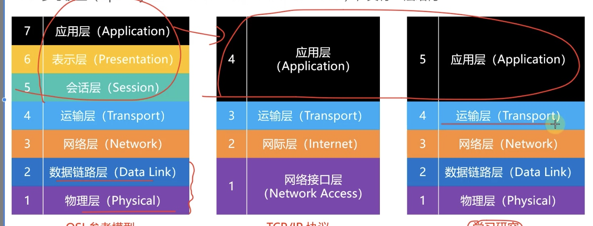

#### 语言跨平台原理

* C/C++：

  C/C++文件要实现跨平台，则需要编译成对应平台的可执行文件。比如说要在Windows上运行，需要编译成PE格式文件；要在Mac上运行，需要编译成Mach-O格式文件；要在Linux上运行，需要编译成ELF格式文件。

  相当于不同平台都得单独编译。

* Java

  Java代码先编译成字节码文件。然后不同平台想要运行Java代码，需要安装JVM。JVM的作用就是将字节码文件翻译成机器指令。然后Java就可以在运行。

  相当于一次编译，多次运行。


### 服务器代码
Serverlet 

### 计算机之间的通讯基础
两台计算机之间想要相互通讯，需要知道对方的IP地址。然后如果要发数据到对方计算机，得把数据发送到对方网卡，由网卡将数据传递给上一层，所以还得知道对方的网卡地址，也就是MAC地址。具体的操作是：
* 将数据通过自己的网卡发送给对方的网卡：
  * 如果网卡发现数据的目标MAC地址是自己，就会将数据传递给上一层进行处理；
  * 如果网卡发现数据的目标MAC地址**不是**自己，就会将数据丢弃，不会传递给上一层进行处理；
* 那如何拿到目标地址的网卡地址呢？ 

  * ARP广播，在不知道对方MAC地址的情况下，会通过ARP广播，如果发现是自身的IP地址，则就会把MAC地址返回回去。ARP广播会对所有的设备部发送广播。(ARP广播通俗点就是给所有设备发送一条信息，询问：你是否知道这个IP地址的MAC地址是什么吗？)

* MAC地址：是有生产厂商设置的。当Mac地址是全F的，则说明是广播地址
* IP地址：每一台主机都有一个IP地址。IP地址由两部分组成：网络标识(网络ID)+主机标识(主机ID)
	* 同一网段的计算机，网络标识相同；
	* 网络 ID = 子网掩码 & IP地址 

#### 计算机连接方式
* 网线直连：需要用交叉线直连；
* 同轴电缆：半双工通信，容易冲突；
* 集线器：半双工通信，容易冲突、不安全；当一台设备让某个Mac地址发送消息时，会对与之相连的所有设备都发送1次
* 网桥：能够通过自学习得知每个接口那侧的MAC地址（缓存Mac在当前网桥的哪一侧）。从而起到隔绝冲突域的作用；
* 交换机：相当于更多接口的网桥，全双工通信。（相当于交换机有很多接口，然后每个接口都能记录该接口对应那一端的所有设备的Mac地址。这样就不会像集线器一样给所有的设备发送信息，而不是给所有的连接设备发送信息。当然了第一次广播，肯定也是所有的设备都会发射一次）组件局域网肯定要使用交换机。
* 路由器：
	* 网线直连、同轴电缆、集线器、网桥、交换机
		* 连接的设备必须在同一网段；
		* 连接的设备处在同一广播域；
		* 网段：通常我们看到的192.16.1.10、 192.16.1.11、192.16.1.12。192.16.1就可以认为是同一个网段。同一网段就形成了同一广播域，也就是说ARP只会在这一区域发生广播。所以不同网段的设备是没法通过网线直连、同轴电缆、集线器、网桥、交换机这些方式进行通信的。
	* 路由器就是用于在不同网段中进行通信、转发数据的设备。起到隔绝广播域的作用。
	```
	IP地址1s：192.16.1.10、 192.16.1.11、192.16.1.12
	IP地址2s：192.16.2.10、 192.16.2.11、192.16.2.12
	
	IP地址1s中的设备是无法直接与IP地址2s中的设备进行通信的。(不在同一网段的设备无法收到ARP广播，也就是无法拿到MAC地址，也就无法进行通信)
	IP地址1s中的设备之间可以使用交换机进行通信(这个可以理解为一个网段或广播域，ARP广播可以相互接收到)
	要想使IP地址1s中的设备与IP地址2s中的设备进行通信，则需要使用路由器。
	IP地址1s的交换机 ———— 路由器 ———— IP地址2s的交换机
	```
	其次路由器也有多个对外接口，这个接口称为**网关**，网关有自己的IP地址和MAC地址。每个网关与对应的广播域是属于同一网段。这样当路由器的网关接收到一个通信信息时，就能够知道发给哪一个网关的IP地址了。(网关也是有MAC地址的)

所以当代的技术就是：交换机+路由器。
路由器中的WAN口连接外网，LAN口连接内网。家用无线路由器里内置了交换机。
总结：
	交换机连接的设备在同一个网段。同一个网段代表在同一广播域，所以任一设备发出的东西，同一网段（广播域）的所有设备都能够收到。 如果全球所有的设备都用交换机连接在一起，那么就会形成广播风暴——只要有任一设备发送信息，全球其他所有设备都能收到。所以我们通过路由器来隔离不同网段的设备。


### 互联网
* ISP : 因特网服务提供商。比如：移动、电信、联通。
* 局域网：局域网使用的网络技术叫以太网。
* 上网方式：
	* 电话线：使用调制解调器，将数字信号和模拟信号进行转换
	* 光纤：使用光调制解调器，将数字信号与光信号进行转换 

### 网络分层

OSI  7层参考模型：应用层、表示层、会话层、运输层、网络层、数据链路层、物理层；


TCP/IP 5层协议模型：
* 应用层: 
	处理的数据是：**报文、用户数据**；
	常用协议是：FTP、HTTP、SMTP、DNS、DHCP等；
* 运输层:
	处理的数据是：段；
	常用的协议是：TCP、UDP；
* 网络层：
	处理的数据是：包；
	常用的协议是：IP、ARP、ICMP；
* 数据链路层:
	处理的数据是：帧；
	常用的协议是：CSMA/CD、PPP；
* 物理层:
	处理的数据是：比特流；
	常用的协议是：无；

#### 物理层
物理层定义了接口标准、线缆标准、传输速率、传输方式等；比如网线、路由。
##### 信号
* 数字信号：适合短距离传输，稳定性高；
* 模拟信号：适合长距离传输，稳定性差；
##### 数据通信模型
* 局域网通信模型
	PC ——数据信号/网线—— 集线器或交换机 ——数据信号/网线—— PC
	注意：网线不能超过100米
* 广域网通信模型
	PC ——数据信号/网线—— 调制解调器 ———模拟信号/电话线——— 调制解调器 ——数据信号/网线—— PC
	调制解调器就是对数字信号和模拟信号进行转换。
##### 信道
* 信道：
	信息传输的信道。一条传输介质(比如网线)上可以有多条信道。(比如A到B，B到A就是两条信道)
* 单工通信：
	信号只能往一个方向传输。比如无线电广播，有线电视广播；
* 半双工通信：
	信号可以双向传输，但是同一时间只能往一个方向传输。比如对讲机；
* 全双工通信：
	信号可以同时双向传输。比如手机(打电话，听说同时进行)
	
#### 数据链路层
* 链路：从一个节点到相邻节点的一段物理线路(有线或无线)，中间没有任何交换节点。
* 数据链路：在一条链路上传输数据时，需要有对应的通信协议来控制数据的传输
	* 不同类型的数据链路，所用的通信协议可能是不同的。
		* 广播信道：CSMA/CD协议；(比如同轴电缆、集线器等组成的网络)
		* 点对点信道：PPP协议(比如2个路由之间的通信)
##### 数据链路层的3个基本问题
* 封装成帧：
	IP数据包(网络层数据包), 给其添加帧首部和帧尾部。
	注意：每一种数据链路层协议都规定了所能够传输的帧的数据长度上限。(比如以太网的最大长度为1500个字节)。
* 透明传输：
	是指在传输过程中会进行一些转义(细节可以忽略)。
* 差错检验：
	数据链路层会**将IP数据和数据链路层首部计算出一个FCS数据放在帧尾部**。当传输到另一端的时候，接收端也会对IP数据包与数据链路层首部计算出一个值，然后将其与FCS进行比较来判断IP数据包是否有差错。
#### 网络层
* 网络层数据包（也叫IP数据包）由首部、数据2部分组成。这里的数据是由传输层传递下来的数据段，然后首部字段至少占用20个字节(大部分都是20字节)，最长60个字节
##### 网络层包含的首部字段
* 版本：指 IPv4 or IPv6，占4位；
* 首部长度：表示首部实际长度，占4；
* 区分服务：用来提高网络的服务质量，占8位。(区分服务如果有特殊字段，数据链路层可能会让其提前通过)；
* 总长度：首部+实际数据的总长度；
* 标识：当数据包过大时，就需要进行分片。这个标识就是用来表示哪些片是属于同一个数据包的，占16位；
* 标志：占3位，第一位不使用，第二位表示是否允许分片（如果设置了不允许分片，但是长度又超过了1500，则就会报错发不出去）；第三位表示是否是最后一片（因为每一片到底时机不一样，所以并不能确定是否都到达了）；
* 片偏移：分片数据的首字节相对于原始数据包中的字节偏移位置除以8，占13位；(标识表示是同一个数据包，片偏移就能表示当前分片是处于数据包的哪个位置，除以8就怕13位不够使用)。
* 协议：存储使用到的协议；(比如从运输层传过来的，可能就有TCP或UDP。但是有的数据可能不是从运输层传过来的。像ICMP协议，直接就可以从网络层发送数据)
* 首部校验和：用来差错检测，类似数据链路层的差错检测；
* 生存时间：主要是可以用来查询经过哪些路由器。
* 源IP：
* 目标IP：
##### 分片
因为数据链路层的数据长度不能超过1500个字节。所以对于特别大的数据，就会将其进行分片。分片是在传输层进行的。
* 每一片都有自己的网络层首部(IP首部)


#### 传输层
传输层有两个协议
* TCP 传输控制协议
* UDP 用户数据报协议

##### TCP & UDP
* 连接性：		
   TCP 面向连接；
   UDP 无连接；

* 可靠性：
   TCP 可靠传输、不丢包；
   UDP 不可靠传输,尽最大努力交付、可能丢包；

* 首部占用空间：
   TCP 大；
   UDP 小；

* 传输速率：
   TCP 慢；
   UDP 快；

* 资源消耗：
   TCP 大；
   UDP 小；

* 应用场景：
   TCP 浏览器、文件传输、邮件发送； 
   UDP 音视频通话、直播；

* 应用层协议：
   TCP：HTTP、HTTPS、FTP、SMTP、DNS；
   UDP：DNS

##### UDP —— 用户数据报协议
* UDP 是无连接的，减少了建立和释放连接的开销

* UDP 尽最大努力交付，不保证可靠交付

* 因为无需维护一些复杂的参数，所以首部就只需要8个字节。首部主要包括：**源端口号**、**目标端口号**、**UDP长度**（首部长度+数据长度）、**UDP检验和**（UDP会在计算检验和的时候在首部和数据之外添加一个伪首部，这个伪首部包含源IP地址、目标IP地址、协议、UDP长度。然后UDP会使用伪首部、首部、数据计算出一个检验和。最后检验和再放到首部里，而不会往网络层传递）。

##### TCP —— 传输控制协议
###### 首部：
  TCP首部是由20个字节的固定长度和部分可变长度一起组成。首部长度在20~60直接。
  * 源端口：**（重要）** 
  * 目标端口 ：**（重要）** 
  * 序号：**（重要）** TCP数据部分的编号(实际取的是数据部分第一个字节的编号)；
  * 确认号：**（重要）** 表示的是期待下一次收到的TCP数据的序号；也表示确认收到前面的数据，所以叫做确认号
  * 数据偏移：占4位。数据偏移的值 * 4 === 首部长度。(这里和UDP不一样，它这个长度没有包含数据长度。那这个数据长度怎么计算呢？首先网络层也含有首部字段，接收端可以根据网络层首部的总长度计算出传输层数据的段总长度，然后减去偏移量，就是传输层数据长度。其实UDP也可以这样计算出来)
  * 保留：暂时全为0，应该是没有用上
  * 标准位：**（重要）**
  	* URG：紧急指针，为1表示当前报文有紧急数据，应尽快传送；
  	* ACK：确认号，为1表示确认连接；
  	* RST：重置，为1表示连接中出现差错，必须释放连接，然后重新建立连接；
  	* SYN：为1 表示建立连接的请求；
  	* FIN：为1 表示要求释放连接；
  * 窗口：**（重要）** 用于告诉对方下一次运行发送的数据大小；
  * 检验和：和UDP是一样的，检验和 == 伪首部 + 首部 + 数据。这个伪首部包含源IP地址、目标IP地址、协议、UDP长度。然后UDP会使用伪首部、首部、数据计算出一个检验和。最后检验和再放到首部里，而不会往网络层传递
  * 紧急指针
  * 可变选项
  * 填充

###### 建立连接
* 三次握手：

  客户端给服务器发送一个建立连接请求；SYN = 1， ACK = 0，seq = x；(seq 表示客户端初始序号)

  服务器接收到建立连接请求后，会返回一个确认报文，并携带一个建立连接的请求：SYN = 1，ACK = 1，seq = y, ack = x + 1；(seq 表示服务器初始序号，确认号就是客户端序号 + 1)

  客户端收到后会返回一个确认建立连接的请求；SYN = 0， ACK = 1，seq = x + 1， ack  = y + 1；

  * 服务器一开始肯定是占用了某一个端口，在监听状态。
  * 双方会交换一些信息。比如是否支持SACK、MSS(最大)、窗口缩放系数等
  * 为什么要三次，两次不行吗？
  	假如客户端发送建立连接的请求报文发生了超时，客户端会启用超时重传策略，重新发送连接请求，Server端收到了会回复确认报文，那之后又收到了之前超时的请求连接，，服务器又会返回确认连接的报文。如果没有第三次握手，那么这样就会又建立一次连接，相当于建立了两次连接。而多了那次客户端确认报文的话，服务器发送第二次确认报文后，客户端不会返回第三次握手，那么后面那次连接就建立不起来。
  * 如果第三次握手失败了，会发生什么？
  	第二次握手后，此时服务器的状态为等待确认状态。若等不到客户端发出的第三次握手，服务器就会重新发送SYN+ACK包(第二次握手)，如果多次重发SYN+ACK后都等不到客户端的确认，就会发送RST包，强制关闭连接。

* 四次挥手：

  三次握手建立连接之后，客户端和服务器就可以发送和接收数据了。数据收发完毕之后，就会断开连接。

  1：首先客户端发送一个FIN关闭连接的报文，

  2：服务器接收到后，就返回一个ACK的确认报文。

  这样客户端往服务器的方向就关闭了。

  因为TCP是全双工连接，一旦建立连接。客户端可以往服务器发送数据，服务器也可以往客户端发送数据。所以关闭就得双方向都关闭。

  3：服务器也得发送一个FIN的关闭连接的报文，

  4：客户端接收到后，就会返回一个ACK确认报文。

  这样服务器往客户端的方向才能关闭。

  * 有时候我们也会看到只有3次挥手的情况。其实就是第2次和第3次挥手合并了。出现这种情况的前提就是当服务器收到FIN时，发现自身也没有数据要发给客户端了。这个报文既包含第2次的ACK，也包含第3次的FIN报文。

###### **可靠传输**：
* 可靠传输使用的是ARQ**停止等待**协议。
  发送一个数据包就停止发送，等待确认。
    * eg1: 正常情况下，发送方每发送一个数据段，接收方收到后会返回一个确认报文，然后发送方再发送下一个报文。(无差错情况)
    * eg2: 当发送方发送完数据包之后，**数据丢包了**，接收方没有收到数据段，那么发送方在**超时时间**到达时没有收到确认报文，则会**重新发送刚才的数据段**；(超时重传)
    * eg3: 当发送方发送完数据段之后，如果接收方接收到数据了，但是**返回的确认报文丢失了**，那么发送方同样会在超时时间到达时重新发送数据, 接收方收到后会将重复的数据丢弃，再返回确认。(确认丢失)
    * eg4: 当发送方发送完数据段之后，如果接收方接收到数据了，但是**返回的确认报文迟到了**，那么发送方同样会在超时时间到达时重新发送数据，但是隔了很久后迟到的确认报文又被发送方收到了，此时发送方就什么也不会做。(确认迟到)

问题：这样的发送效率会非常低。因为每一次发送都得等待前面的数据确认收到后才能发送下一个数据包。

* 连续ARQ**停止等待**协议 + 滑动窗口协议
  所谓滑动窗口，就是发送端有一个发送窗口用于连续发送数据包，接收端有一个接收窗口用于接收数据包。当发送窗口中的数据包连续发送完成后，就会停止发送，等待确认。当接收窗口接收到所有数据包之后，就会返回一个确认报文，返回的确认报文包含确认序号(期望收到的下一个数据包的序号)。发送方接收到确认报文后，就会滑动当前窗口，接着发送下一组数据。另外发送方有一个发送缓存，接收方有一个接收缓存。
  * eg: 发送端增加一个发送窗口。假设发送窗口里有4个连续的数据包，发送端在将4个连续的发送闭包发送完成之后，停止发送，等待确认。接收端在接收到最后一个数据包后，会返回一个确认报文。发送端收到确认后，就接着发送其他的数据段。

	* 具体过程：
		* 首先，建立TCP连接(3次握手)时，接收端会告诉发送端，当前接收窗口的大小，以便滑动窗口大小调整。
		* 然后发送方开始将发送窗口里的数据段连续发送出去。发送完成后，停止发送，等待确认。
		* 接收方接收到数据后，会返回一个确认报文，这个确认报文还附带一个确认序号。其次接收缓存会将已收到的连续数据传输给应用层，然后接收缓存会将已发送给应用层的数据删掉。
		* 发送方接收到确认报文后，将窗口进行滑动，然后删掉发送缓存里已发送的数据，然后接着发送下一批数据包。
		* 那如果发送数据段中出现了丢包的情况。假设序号为5、6、7、8，丢失了序号为7的包。那么接收方在接收完后，首先会将滑动窗口移动到7的位置。然后返回确认报文，确认报文里的确认号就是7。
		* 发送端接收到确认报文后，就会将发送窗口滑动到7的位置，然后重新开始发送连续数据包。但是这里要注意一点，因为数据段8已结被接收到了，所以发送端不会再将数据段8再发送出去（这种技术叫做**SACK选择性确认**，就不会重复发送已结发送成功的数据段，只发送已丢失的数据段。而实现这个技术的关键就是根据首部字段的**可变选项**，它会包含已经接收的数据段编号和未接收到的数据段编号）。

###### 流量控制：
* 如果接收方的缓存区满了，发送方还在疯狂发送数据。

  * 接收方只能把收到的数据段丢掉。这样就会造成网络资源浪费；

* 也可能是网络太差了。所以需要告诉发送方一次性不要发送那么多数据包。 
  所以就需要控制发送方的发送速率。流量控制就是让发送方的发送速率不要太快，让接收方来得及接收处理；
  流量控制也是通过滑动窗口协议做的。滑动窗口的大小不是固定的，是动态调整的。它是通过确认报文首部的窗口字段来控制发送速率的。发送方的发送窗口不能超过接收方给出的窗口大小。
  当发送方收到接收窗口的大小为0时，那么就会停止发送。以此同时，发送方会主动开启一个定时器，隔一段时间发送一个测试报文去询问接收方最新的窗口大小。如果测试报文接收到的确认信息窗口大小还是0，则会再次刷新定时器。

  

###### 拥塞控制：

拥塞控制就是为了防止过多的数据注入到网络中，防止网络中的路由器或链路过载。
发送方除了有一个发送窗口，还有一个**拥塞窗口**。如果网络比较拥塞时，那么拥塞窗口就会比较小。发送窗口除了跟接收端的接收窗口有关，也跟拥塞窗口有关。具体来说：
**发送窗口大小 == min(拥塞窗口大小，接收窗口大小)**。

具体步骤：

* 慢开始 && 拥塞避免
	* 慢开始
		拥塞窗口慢慢变大，比如显示一个数据段大小，后面就2个数据段大小，然后4、16等**成倍增长**，一直到达到慢开始**阈值**。
	* 拥塞避免
		就是在慢开始到达阈值后，就开始以**线性方式增长**，放慢增长速度，避免过早出现拥塞。只要出现网络拥塞，把阈值减半，与此同时，再开始执行慢开始。
* 快重传 && 快恢复
	* 快重传
		接收方在收到一个失序的数据段后，就立即发出重复确认。比如接收方接收到了数据段1、数据段2、数据段4，那么它就发现数据段3没有接收到，所以就会连续发送3个确认收到数据段2（确认报文里就有想要收到数据段3的确认号），发送方收到重复确认后，就知道数据段3没有发送成功，所以就会立马再次发送数据段3，就不会等待超时重传了。
	* 快恢复
		快恢复就是在达到拥塞后，阈值会降低，降低后，就不再执行慢开始，而是继续执行新的线性增长（类似拥塞避免的增长方式）。

#### 应用层

##### DNS

由于IP地址不方便记忆。所以就使用域名来对应IP地址。不过在真实的网络请求过程中，肯定还是直接使用IP地址，因为要在路由器中进行传输，肯定得知道目前IP地址。

DNS就是将域名解析成对应的IP地址。DNS是可以缓存的（可以使用命令行查看、清空缓存的DNS）。

* 具体过程

  客户端想要连接某台服务器的时候，比如百度，是先拿到百度域名www.baidu.com ，然后往DNS服务器发送一个数据包（数据包包含域名信息），然后DNS服务器返回一个数据包（数据包包含IP信息）。客户端拿到IP地址之后，就可以进行正常的网络请求了。

  其实每一级域名都有对应的DNS服务器。比如根域名服务器、顶级域名服务器、二级域名服务器等。所有DNS服务器都记录了根DNS服务器的IP地址，上级DNS服务器都记录了下一级DNS服务器的IP地址。（全球一个23台顶级的根DNS服务器）

  

##### DHCP

* IP地址可以分为静态IP和动态IP地址。

  比如台式电脑可以使用静态地址，服务器也可以使用静态IP地址。

  动态IP地址则就是从DHCP服务器获取的，比如移动设备、无线设备等。

* DHCP协议使用的是UDP协议，客户端使用68端口，服务器是67端口。

* 当设备从DHCP服务器请求IP地址时，DHCP会从IP地址池中，挑选一个IP地址“出租”给客户端一段时间，时间到期就回收它们。

* 具体过程

  * 查找服务器

    客户端 发广播包（源IP：0.0.0.0，目标IP：255.255.255.255，目标MAC：FF.FF.FF.FF）

  * 提供租约

    服务器 返回可以租用的IP地址，以及租用期限、子网掩码、网关、DNS等信息。

  * 选择IP地址

    客户端 选择一个IP地址，发送广播包进行回应

  * 确认

    被选中的服务器发送ACK数据包给客户端

##### HTTP

HTTP 超文本传输协议。（因为最初的HTTP协议就是为了发布和接收HTML页面，HTML是超文本标记语言，所以HTTP就被命名为超文本传输协议，不过到了现在，HTTP已应用特别广泛，不在仅限于HTML了）

* 历史版本
  * （1991）HTTP / 0.9 :  只支持GET请求获取文本数据，且不支持请求头、响应头等。
  * （1996）HTTP / 1.0 ：支持POST、HEAD等请求方法，支持请求头、响应头等，支持更多数据类型；浏览器的每次请求都需要与服务器建立一个TCP连接，请求处理完成后立即断开TCP连接。
  * （1997）HTTP / 1.1：支持PUT、DELETE等请求方法；采用持久连接（connection：keep-alive），多个请求可以共用一个TCP连接；
  * （2015）HTTP / 2.0：

* HTTP报文

  * 请求报文

    * 请求行：

      方法        URL       HTTP版本

    * 请求头：

        HOST：服务器域名+端口号	。xxx:8080	

        Connection：keep-alive

        Cache-Control：用来指定在这次请求/响应链中的所有缓存机制。Cache-Control：no-cache

        User-Agent：浏览器的身份标识字符串。User-Agent: XX/3.3.0 (iPhone iOS13.4)

        Accept：客户端能够接受的响应内容的类型

        Accept-Charset：客户端能够接受的字符集

        Accept-Encoding：客户端能够接受的编码方式列表

        Accept-Language：客户端能够接受的响应内容的自然语言列表

        Cookie：之前由服务器Set-Cookier发送的Cookie。Cookie：$Version=1;Skin=new;

        Date：发送该消息的日期和时间

        Content-Type：请求体类型。Content-Type：multipart/form-data

        Content-Length：请求体长度。Content-Length：348

        Referer：表示浏览器访问的前一个页面，正是从该页面跳转进了当前页面

        Range：仅请求某个实体的一部分，适用于断点下载。Range：bytes=500-999

        Origin：发起一个针对跨域资源共享的请求。与响应头里的Access-Control-Allow-Origin成对。Origin：https://www.baidu.com

        Connection：浏览器想要优先使用的连接类型。Connection：keep-alive

        

    * 请求体（一般post请求的参数放在请求体，get请求参数使用？&拼在URL后面，而且URL的长度有一定限制）：

        参数

  * 响应报文

    * 状态行：

      HTTP版本	状态码	短语	

    * 首部行：

      Content-Length：响应体长度。Content-Length：348

      Connection：连接方式，比如长连接。Connection：close

      Date：发送该消息的日期和时间

      Last-Modified：所请求的对象的最后修改日期

      Server：服务器名字

      Expires：指定一个时间，超过该时间则认为响应过期

      Content-Type：响应体类型。Content-Type：text/html；charset=utf-8

      Content-Encoding：内容所使用的编码类型。Content-Encoding：gzip

      Content-Disposition：一个可以让客户端下载文件并建议文件名的头部

      Accept-Ranges：服务器支持哪些种类的部分内容范围

      Content-Range：这部分消失属于完整消息的哪部分

      Access-Control-Allow-Origin：指定哪些网络可以参与到跨域资源共享过程中。Access-Control-Allow-Origin：*

      Location：用来进行重定向，或者在创建某个新资源时使用。Location：http://www.w3.org

      Set-Cookier：返回一个Cookie让客户端去保存。Set-Cookier：UserID=xxx

      Cache-Control：向从服务器到客户端在内的所有缓存机制告知，它们是否可以缓存这个对象，单位为秒。Cache-Control：max-age=3600

      

    * 实体主体：

      

* URL 编码

  URL中一旦出现了特殊字符，比如中文、空格，就需要编码

  浏览器地址输入栏输入的URL，采用的是UTF-8编码

* 请求方法

  * GET：一般用于读取操作；请求参数直接拼接在URL后面（但是浏览器对URL长度有限制）

  * HEAD：请求得到与GET请求相同的响应，但是没有响应体。

    场景：在下载大文件前，可以先发送一个HEAD请求，获取文件大小，再决定是否下载，以此来节约带宽资源。

  * POST：常用于添加、修改、删除操作，请求参数放到请求体中（没有大小限制）

  * PUT：对已存在的资源进行整体覆盖。（不安全，不常用）

  * PATCH：用于对资源进行部分修改（资源不存在，会创建新的资源）

  * DELETE：删除指定资源

  * CONNECT：可以开启一个客户端与所请求资源之间的双向沟通的通道，它可以用来创建隧道

    可以用来访问采用了SSL协议的站点。

  * OPTIONS：用于获取目的资源所支持的通信方法，比如服务器支持的请求方法：$ OPTINS * HTTP/1.1

  * TRACE：用于HTTP请求的测试或诊断

  * GET & POST： 安全性、幂等性、可缓存性

* 状态码
  * 信息响应：100~199

  * 成功响应：200~299

  * 重定向：300~399

    * 302：重定向。一般重定向的位置会通过head的location返回一个新的服务器地址。（如果使用前后端分离的话，一般重定向由客户端觉得，服务器不会返回重定向相关内容）

    * 304：可以使用缓存的内容，不返回内容。（主要是通过服务器来判断，比如连续两次请求，第二次服务器发现这次请求的内容一直没变过，且请求头里有说明有缓存策略。所以就不再返回内容，而是使用304）

  * 客户端错误：400~499

    * 400：服务器无法解析请求，说明语法错误
    * 401：由于缺乏目标资源要求的身份验证凭证
    * 403：服务器有能力处理该请求，但是拒绝授权访问
    * 404：服务器无法找到所请求资源
    * 405：服务器禁止了使用当前请求方式
    * 406：服务器无法提供客户端想要的Accept方式的响应

  * 服务器错误：500~599

    * 500： 服务器遇到意外强行终止
    * 501：服务器本身不支持请求方法。但是规定所有服务器必须支持Get和HEAD请求
    * 502：作为网关或代理角色的服务器，从上游服务器中接收到的响应是无效的
    * 503：服务器尚未处于可以接受请求的状态。一般是因为服务器停机了。

* 跨域

  * 前后端分离：一般来说前端代码需要部署到服务器中，如果前端代码和服务器代码是部署在不同服务器，就叫做前后端分离。
  * 同源策略：浏览器有个同源策略。默认情况下，AJAX请求（异步请求的一种）只能发生给同源的URL（**同源是指协议、域名、端口相同**）（并不是所有的对象都得同源，只有部分请求需要遵循同源策略）。
  * 所以很多浏览器请求页面数据都会面临页面和数据不同源的情况（比如服务器的端口号是8080，前端代码是在6464端口，那么就会受到跨域的影响）。
  * 所以要解决跨域问题，就是服务器要在响应头里返回相关的支持字段，比如Access-Control-Allow-Origin。告知浏览器一个允许跨域访问的请求。
  * 跨域的策略只是服务器用来限制某些域名才能够访问的安全机制。但是并不是所有的对象都受同源策略的影响。

* Cookie&Session

  * 当客户端登录成功后，服务器会创建一个Session对象，Session对象包含一个id（比如666），也可能会存储登录信息。
  * 然后服务器在响应头里的Set-Cookier字段会返回一些信息，比如:SessionId（对应着刚才登录时Session对象的ID）、domain、path等。
  * 客户端拿到Set-Cookier的响应头后，就会将这个Cookie存储起来。下一次客户端请求的时候，如果发现path、domain和Cookie里面的一样，那么就会自动带上这个Cookie。
  * 所以使用了Session和Cookie，那么就能够解决HTTP无状态的问题。


##### 网络安全

网络通信中，存在4中安全威胁

- 截获 （被动）：窃听通信内容
- 中断 （主动）：中断网络通信
- 篡改 （主动）：篡改通信内容
- 伪造 （主动）：伪造通信内容


###### HTTP安全问题
HTTP协议默认采用明文传输，因此有很大的安全隐患
* 对通信内容进行加密，再进行传输。
* 常见的加密方式：
  * 不可逆：

    * 单向散列函数：MD5、SHA等。

      任意长度的消息，计算出固定长度的散列值，计算速度快，消息不同，散列值也不一样。所以单向散列函数可以防止数据被篡改。其次也更多应用在密码加密，也就是将明文的密码进行加密后传输，其次数据库也存储加密之后的散列值，避免数据库数据泄露后，用户数据被轻易破解。忘记密码后也只能重置密码。

  * 可逆： 
    * 对称加密：DES、AES等

    * 非对称加密：RSA等

      由接收者生成密钥对。然后将公钥公开供发送端加密，然后接收端用私钥解密。
  * 其他
    * 混合加密系统

      对称+非对称。STL

    * 数字签名

      数字签名虽然和非对称加密差不多，但是实际上它不是用来做加密的，而是主要验证数据的可靠性。

      数字签名的公私钥是由发送端生成的。

      发送者在将消息发送给接收者之后还会同时发送一份使用私钥加密后的签名。然后接收者拿到消息之后，同时也使用公钥对签名进行解密，解密完成之后跟消息进行对比，如果对比一样，那么就说明消息是可靠的。

      当然了。如果消息太大了，觉得签名会过大。那么就可以先进行单向散列函数，对消息进行摘要。

    * 证书 

      但是上面的问题是公钥容易被伪造。其实只要是公钥在互联网上传输，就容易出现中间人攻击。

      证书就是第三方机构CA结合非对称加密与数字签名一起来对公钥进行安全传输的方式。

      

非对称加密与数字签名总结：

可以发送非对称加密和数字签名是两个正好相反的过程。非对称加密，公私钥由接收者生成，发送者使用公钥进行加密，接收者使用私钥进行解密；数字签名时，公私钥由发送者生成，发送者使用私钥进行加密，接收者使用公钥进行解密。

理解：既然是加密，那肯定是希望只有自己才能解密。所以公钥负责加密，私钥负责解密。如果是签名，那肯定是不希望有人篡改我发送的消息，所以由私钥负责签名，公钥负责验签。


##### HTTPS

HTTPS = HTTP + SSL/TLS


##### 代理服务器

代理服务器可以看做是一个中介。

它本身不生成内容。只是转发上下游的请求和响应。

为什么要代理服务器？因为有可能我们可能连不上目标服务器。比如访问国外服务器，那么就需要借助代理服务器。为客户端提供服务的叫做正向代理，为服务器提供服务的叫做反向代理。

对于客户端：代理服务器可以隐藏客户端身份；绕过防火墙；访问控制；数据过滤等。

对于服务器：隐藏服务器身份；安全防护；负载均衡等。

* 抓包工具Charles的原理就是：在客户端启动了正向代理服务。
* 使用代理服务器的话，会在请求头和响应头设置一些相关信息，比如Via、X-Real-IP 客户端的真实IP地址。


##### CDN

CDN 叫做内容分发网络。它利用最靠近每位用户的服务器，将更快更可靠的资源传递给用户。

CDN是由CDN运营商提供的，比如移动、连通等


#### 其他

##### 网卡

网卡在数据链路层；

网卡影响处理数据的速度

##### 端口
* 客户端的端口是临时开启的随机端口。一旦请求完成就会关掉。
* 服务器端口是固定不变的，常见的服务端默认端口：
  * HTTP	默认端口号：TCP + 80；
  * HTTPS    默认端口号：TCP + 443
  * FTP  	默认端口：TCP + 21
  * MySQL   默认端口：TCP + 3306
  * DNS	默认端口：UDP\TCP + 53
  * SMTP	默认端口：TCP + 25
  * POP3	默认端口：TCP + 110
* 防火墙可以通过设置开启、关闭某些端口来提高安全性。

##### TCP 疑问
* 若有一个包重传了N次还是失败，会一直持续重传到成功为止吗？
	这个取决于系统设置。比如有些系统，重传5次未成功就会发送reset报文（RST 为1），断开连接。
* 如果接收窗口最多接收4个数据包，但是发送方只发了2个数据报，那么接收方如何确定后面还有没有2个包。
	接收方接收到那个2个数据包后，会等待一定的时间后，如果没有收到其他的包，就会返回确认报文。
* 为什么选择在传输层进行分段，而不是在网络层再分片？
	因为可靠传输是在传输层进行控制的。如果没有分片，一旦出现数据丢失，那么就得将整个数据重传。
* 

##### 怎么区分长连接和短链接？

* 通常来说连接建立成功后，只进行了一次数据交互就断开连接的连接就是短链接；如果建立连接后，会持续进行多次数据交互之后才释放的连接就是长连接。


##### 多个客户端如何与服务端进行连接

每个客户端跟服务器之间的连接都是通过socket。每个客户端开始与服务器进行连接的时候都会生成一个socket对象。然后服务器有一个ServerSocket一直处于监听状态，一旦监听到客户端的请求，就会通过ServerSocket生成一个对应的socket。也就是说，有多少个客户端，服务器也会对应生成多少个socket。


